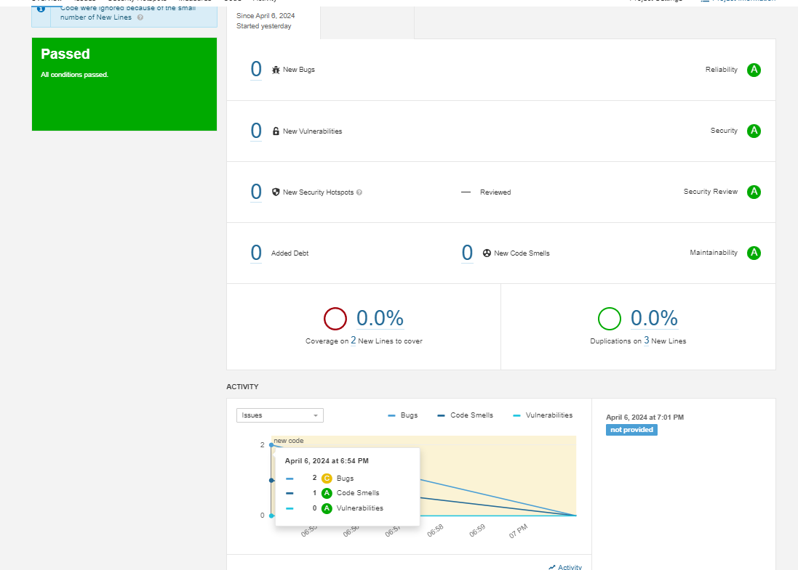

# mnt-homeworks-03-cicd
Домашнее задание к занятию 9 «Процессы CI/CD»

1. Создал две виртуальные машины
2. Установил при помощи ansible необходимое ПО
3. Успешно проверил и исправил код в SonarQube

4. Дважды загрузил артефакт в Nexus

<metadata modelVersion="1.1.0">
<groupId>netology</groupId>
<artifactId>java</artifactId>
<versioning>
<latest>8_282</latest>
<release>8_282</release>
<versions>
<version>8_102</version>
<version>8_282</version>
</versions>
<lastUpdated>20240407182827</lastUpdated>
</versioning>
</metadata>

5. Сломалась виртуальная машина после перезагрузки)
   Загружу решение по Maven завтра.